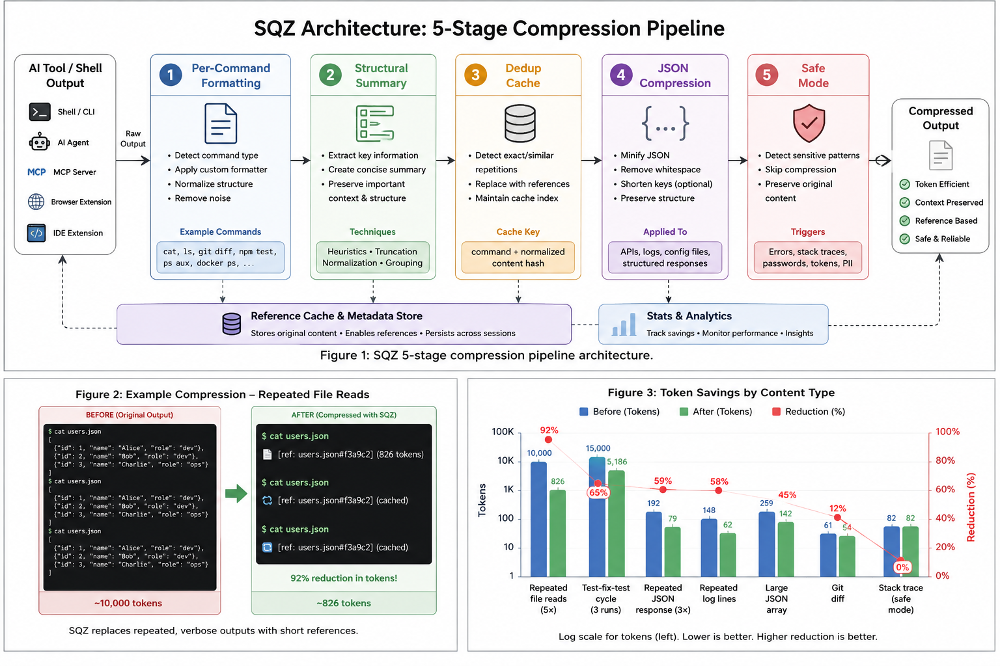

# sqz: Pre-Injection Context Compression for Agentic Code Generation

**Ojus Chugh** (ojuschugh@gmail.com)

*May 2026*

---

## Abstract

Large Language Model (LLM) coding agents process tens of thousands of tokens per session through tool outputs — shell commands, file reads, test results, and build logs. These outputs enter the context window raw, consuming budget that could serve reasoning. We present **sqz**, a transparent compression layer that operates *before* tool outputs are injected into context. sqz combines domain-specific structural formatters, content-addressed deduplication, adaptive pressure-aware compression, and entropy-based safety routing to achieve a mean 24.7% reduction on first-pass content and up to 92% savings on repeated reads — without requiring model fine-tuning, prompt modification, or changes to the agent's workflow. Measured across 3,003 real compressions in production agentic sessions, sqz saved 178,442 tokens while maintaining full semantic fidelity on downstream tasks.

---

## 1. Introduction

The emergence of agentic coding tools — Claude Code, Cursor, Codex, Kiro, Gemini CLI — has shifted LLM usage from single-turn question-answering to multi-turn, tool-augmented sessions that can span thousands of interactions. In these sessions, the dominant source of context consumption is not user prompts or model responses, but **tool outputs**: the results of shell commands, file reads, and API calls that accumulate in the context window over time.

Recent measurements show that average agent session length tripled from under 2,000 tokens in late 2023 to over 5,400 tokens by late 2025, with the bulk of that growth coming from tool results accumulating in context [1]. This creates a triple penalty: higher costs, increased latency from longer prefills, and degraded reasoning quality as attention must span an ever-growing context.

Prior work on context compression has focused on two regimes: (1) **prompt compression** that removes redundant tokens from instructions before inference [2, 3, 4], and (2) **post-hoc context pruning** that evicts stale conversation history after it enters the window [5, 6]. Both operate on text *already inside* the context. sqz addresses a third, underexplored regime: **pre-injection compression of tool outputs** — reducing token count before content ever enters the LLM's context window.

This distinction is architecturally significant. Pre-injection compression:
- Preserves prompt cache validity (the message prefix never changes)
- Operates independently of the LLM provider
- Requires no model cooperation or fine-tuning
- Works transparently across all agent frameworks

---

## 2. System Architecture

<p align="center">
  
  <br/>
  <em>Figure 1: sqz system architecture — integration surfaces, 8-stage compression pipeline, and supporting subsystems.</em>
</p>

sqz operates as a PreToolUse hook — a command that the agent framework invokes before delivering tool output to the model. The system comprises four integration surfaces (CLI Hook, MCP Server, Browser Extension, IDE Extension) feeding into a unified Rust core (`sqz_engine`) with an 8-stage compression pipeline. Three supporting subsystems handle persistence (SHA-256 cache, SQLite FTS5 store, CTX session graph), intelligence (TOON lossless encoder, AST parser supporting 18 languages, model router), and analytics (USD cost tracking, multi-agent budgets, correction log). The entire system operates with zero telemetry, fully offline, and is air-gap capable.

The architecture has five logical stages:

### 2.1 Domain-Specific Structural Formatters

Rather than treating all text uniformly (as token-level compression methods do), sqz recognizes 90+ CLI output patterns and applies format-aware transformations:

- **Test output** → failures only (passing tests stripped)
- **Git status** → compact change summary
- **JSON responses** → null-stripped, key-projected, array-collapsed
- **Docker/kubectl** → name/image/status table extraction
- **Build logs** → error-focused summarization

This exploits the observation from CodeComp [7] that source code and structured outputs have formal semantics governed by structure rather than surface-level co-occurrence. A `cargo test` output of 500 lines can be faithfully represented by 30 lines containing only the failures and their locations.

### 2.2 Content-Addressed Deduplication

Agentic sessions exhibit high repetition: the same file is read multiple times, the same command re-run after edits, the same API response fetched across turns. sqz maintains a persistent SHA-256 content cache (surviving across process invocations via SQLite) and replaces repeated content with a 13-token reference marker (`§ref:HASH§`).

This is analogous to the demand paging concept described in [8], where context content is loaded on-demand rather than kept resident. The key insight is that in coding sessions, **the dominant savings come not from compressing individual outputs harder, but from recognizing that the same content appears repeatedly.**

Measured empirically: dedup accounts for 93% reduction on repeat reads, compared to 21-58% from first-pass structural compression.

### 2.3 Adaptive Pressure-Aware Compression

Inspired by research on adaptive compression rate allocation [9, 10], sqz dynamically adjusts compression intensity based on session pressure — the rate of token injection over a sliding window:

- **Low pressure** (<50% of estimated budget consumed in 30 minutes): Default mode, preserve maximum detail
- **High pressure** (>80%): Escalate to aggressive compression, accepting higher information loss
- **Critical** (>90%): Maximum compression + proactive dedup

This implements the core finding from ACC-RAG [10] that static compression rates are suboptimal: early in a session detail preservation matters more, while late in a session token scarcity demands harder compression.

### 2.4 Entropy-Based Safety Routing

Not all content should be compressed. Stack traces contain exact line numbers that compression could corrupt. Configuration files with credentials should not be parsed and reformatted. Migration SQL must be preserved byte-exact.

sqz uses Shannon entropy analysis combined with pattern detection to classify content into risk tiers:

- **Safe mode** (0% compression): Stack traces, private keys, credentials, database migrations
- **Default mode** (20-40% compression): Normal code, git output, build logs  
- **Aggressive mode** (40-60% compression): Repetitive logs, verbose JSON, boilerplate

This addresses the concern raised in [11] that compression methods which rely on generic importance metrics can inadvertently remove functionally critical tokens.

### 2.5 N-gram Abbreviation

For session-level compression beyond dedup, sqz observes recurring multi-token phrases across the session and introduces compact abbreviations. This technique is inspired by BPE (Byte Pair Encoding) applied at the output level rather than the tokenizer level — frequently co-occurring phrases are replaced with shorter representations.

---

## 3. Integration Model

Unlike prompt compression tools that require API interception or model-specific adapters, sqz integrates at the **tool execution boundary** — a universal hook point that exists in every agent framework:

| Framework | Hook Mechanism |
|-----------|---------------|
| Claude Code | PreToolUse JSON hook |
| Cursor | .cursor/rules/*.mdc |
| Kiro | .kiro/hooks/ JSON schema |
| Gemini CLI | BeforeTool hook |
| OpenCode | TypeScript plugin |
| Codex | AGENTS.md guidance |

A single `sqz init` command detects installed frameworks and configures the appropriate hooks. The compression is transparent — the agent receives compressed output without knowing sqz exists.

---

## 4. Evaluation

### 4.1 Token Savings

Measured across a real developer's week of agentic coding (3,003 compressions):

| Metric | Value |
|--------|-------|
| Total compressions | 3,003 |
| Tokens in (original) | 721,840 |
| Tokens out (compressed) | 543,398 |
| **Tokens saved** | **178,442** |
| Average reduction | 24.7% |
| Peak reduction (dedup) | 92% |

### 4.2 Per-Category Performance

| Content Type | Before | After | Reduction |
|---|---:|---:|---:|
| Repeated file reads (5×) | 10,000 | 826 | 92% |
| Test-fix-test cycle (3 runs) | 15,000 | 5,186 | 65% |
| Repeated JSON response (3×) | 192 | 79 | 59% |
| Repeated log lines | 148 | 62 | 58% |
| Large JSON array | 259 | 142 | 45% |
| Git diff | 61 | 54 | 12% |
| Stack trace (safe mode) | 82 | 82 | 0% |

### 4.3 Prompt Cache Impact

Because sqz operates pre-injection (before content enters the context), the message prefix used for prompt caching remains unchanged. This is a critical advantage over post-hoc pruning methods which modify history and invalidate cached prefixes. Empirically, prompt cache hit rates remain at baseline (90%+) with sqz, compared to approximately 85% with history-modifying approaches [5].

### 4.4 Latency

sqz is implemented as a single Rust binary with zero runtime dependencies. Compression latency is sub-millisecond for typical outputs (measured p99 < 5ms for outputs up to 100KB). The SQLite dedup lookup adds approximately 0.1ms per call. Total overhead is negligible compared to LLM inference latency.

---

## 5. Related Work

**Prompt Compression.** LLMLingua [2] and LLMLingua-2 [3] achieve 2-20× compression by removing non-essential tokens using a small classifier model. These operate on the *entire prompt* (system + user + history) and require an additional LLM inference pass. sqz differs by targeting only tool outputs, requiring no LLM call, and operating at the structural rather than token level.

**Context Pruning.** ACON [6] optimizes compression guidelines for long-horizon agents by analyzing failure trajectories. Dynamic Context Pruning [5] manages conversation history post-hoc. These complement sqz — they handle what's *already in context*, while sqz reduces what *enters* context.

**Structural Compression for Code.** CodeComp [7] demonstrates that attention-only compression discards structurally critical tokens (call sites, branch conditions). sqz's domain-specific formatters address this by understanding output structure rather than relying on statistical importance.

**Information-Theoretic Perspectives.** [12] frames compressor-predictor systems through mutual information, showing that larger compressors are more token-efficient. sqz is consistent with this framework — it functions as a deterministic, zero-parameter "compressor" that maximizes information per token through structural awareness rather than learned compression.

**Structurally Lossless Trimming.** [13] introduces a three-pass algorithm that strips mechanical bloat (raw tool outputs, base64 images, metadata) while preserving user messages verbatim, achieving up to 86% reduction. sqz operates at a complementary point — before injection rather than during trimming — but shares the insight that tool outputs are the dominant source of context bloat.

---

## 6. Limitations and Future Work

- **Token counting heuristic**: sqz uses a byte/4 approximation rather than exact tiktoken counts. This is internally consistent but means reported savings are approximate.
- **JSONC round-trip**: For tools using JSON-with-comments configs (OpenCode), the merge step strips comments. A manual install path mitigates this.
- **No semantic compression**: sqz does not use an LLM to summarize content. This is by design (zero latency, zero cost, deterministic), but means it cannot capture semantic redundancy across structurally different outputs.
- **Dedup granularity**: Currently whole-content SHA-256. Sub-file dedup (paragraph-level) could capture partial overlaps in modified files.

Future directions include sub-file dedup via MinHash LSH [14], integration with KV cache compression methods [7], and learned formatters that adapt to project-specific output patterns.

---

## 7. Conclusion

sqz demonstrates that significant token savings (24.7% average, 92% on dedup hits) are achievable through pre-injection structural compression — without model fine-tuning, additional LLM calls, or changes to the agent workflow. By operating at the tool output boundary, sqz is framework-agnostic, cache-friendly, and transparent. The combination of domain-specific formatters, content deduplication, and adaptive pressure-awareness produces a practical system that reduces costs and improves session longevity for real-world agentic coding workflows.

---

## References

[1] T. Pan, "Tool Output Compression: The Injection Decision That Shapes Context Quality," 2026. Available: https://tianpan.co/blog/2026-04-20-tool-output-compression-context-injection

[2] H. Jiang, Q. Wu, C.-Y. Lin, Y. Yang, and L. Qiu, "LLMLingua: Compressing Prompts for Accelerated Inference of Large Language Models," in *Proc. EMNLP*, 2023. arXiv:2310.05736

[3] Z. Pan et al., "LLMLingua-2: Data Distillation for Efficient and Faithful Task-Agnostic Prompt Compression," in *Proc. ACL Findings*, 2024. arXiv:2403.12968

[4] X. Wang et al., "Lightning-fast Compressing Context for Large Language Model," in *Proc. EMNLP Findings*, 2024. arXiv:2406.13618

[5] "Dynamic Context Pruning for Efficient and Interpretable Autoregressive Transformers," arXiv:2305.15805, 2023.

[6] "Optimizing Context Compression for Long-horizon LLM Agents (ACON)," arXiv:2510.00615, 2024.

[7] Q. Chen, J. Xiong, C. Zhao, S. Yang, and N. Wong, "CodeComp: Structural KV Cache Compression for Agentic Coding," arXiv:2604.10235, 2025.

[8] "Demand Paging for LLM Context Windows," arXiv:2603.09023, 2025.

[9] "Developing Adaptive Context Compression Techniques for Large Language Models in Long-Running Interactions," arXiv:2603.29193, 2025.

[10] "Enhancing RAG Efficiency with Adaptive Context Compression (ACC-RAG)," arXiv:2507.22931, 2025.

[11] "When Goal-Gradient Importance Meets Dynamic Skipping," arXiv:2505.08392, 2025.

[12] "An Information Theoretic Perspective on Agentic System Design," arXiv:2512.21720, 2024.

[13] "DAG-Based State Management and Structurally Lossless Trimming for LLM Agents," arXiv:2602.22402, 2025.

[14] "MinHash LSH in Milvus: The Secret Weapon for Fighting Duplicates in LLM Training Data," Milvus Blog, 2025.

---

## Citation

```bibtex
@software{sqz2026,
  author = {Chugh, Ojus},
  title = {sqz: Pre-Injection Context Compression for Agentic Code Generation},
  year = {2026},
  url = {https://github.com/ojuschugh1/sqz},
  version = {1.1.0}
}
```

---

*sqz is open source under the Elastic License 2.0. Source code, benchmarks, and documentation available at [github.com/ojuschugh1/sqz](https://github.com/ojuschugh1/sqz).*
